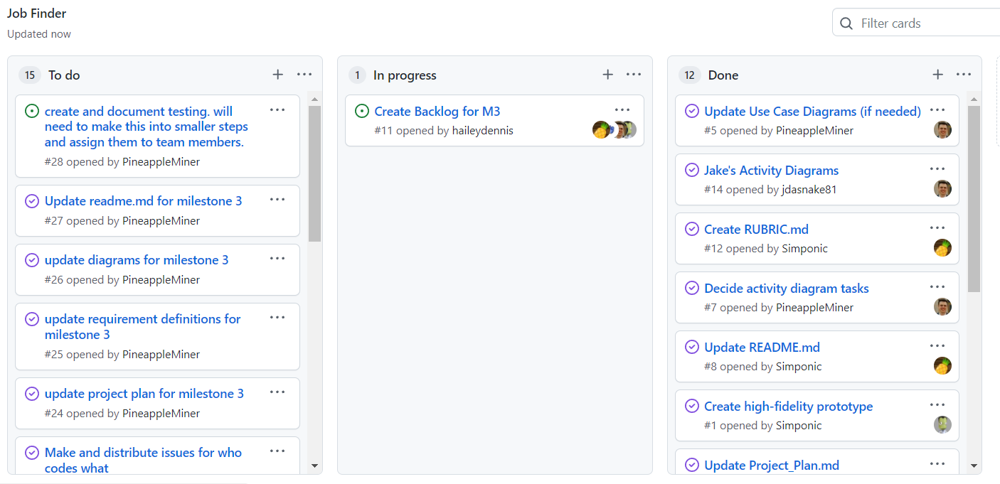

# Team One

#### February 17th - March 3rd
Scrum Master: Logan Hunt

Members: Jake Cogswell, Hailey Dennis, James Field

Each team member commits to working between 15-25 hours on this sprint.

Besides the time we spend working individually we will have 1-2 hour meetings every Tuesday and Thursday
Every team member is expected to attend each meeting. If a situation occurs where a team member can
not attend the meeting they will let the rest of the team know beforehand.

For our team evaluation we will focus on how well each team member communicates.
We will focus on both how well we communicate what we will be working on as well as
how timely we are in informing our other team members about anny issues we face and the solutions we find.

Our end goal for this sprint is to have a working user sign up and sign in page. 
This will allow us to work on the different processes that the users can do after they sign up 
for the next sprints.

