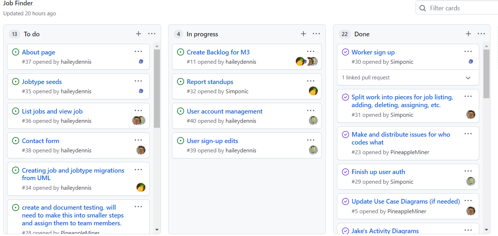

# Team One

#### March 3rd - March 17th
Scrum Master: Hailey Dennis

Members: Jake Cogswell, Logan Hunt, James Field

Each team member commits to working between 15-25 hours on this sprint, at least 50 hours total.

Besides the time we spend working individually we will have 1-2 hour meetings every Tuesday and Thursday
Every team member is expected to attend each meeting. If a situation occurs where a team member can
not attend the meeting they will let the rest of the team know beforehand. Our metric for team evaluation
this sprint will depend on meeting attendance.

Based on our first sprint retrospective, we are aim to improve on code reviews. Each member should be keeping
up with the rest of the teams submissions.

Our end goal for this sprint is to have the majority of job management completed. This includes creating jobs,
listing jobs, viewing and interacting with specific jobs, and assigning jobs. This may push over to the third
sprint as well, since these stories are connected yet the largest in our project.

We will account for Spring Break in our planning by separating tasks into two smaller sprints, one focused on
creating jobs and the other focused on working with jobs.

[Check out our spreadsheet for tracking story points and burdown charts.](https://docs.google.com/spreadsheets/d/1UZuEsLARASGFmn3u9HYPKNd7Qgt6mJ8oqj3Ugj4WRy8/edit#gid=0)

