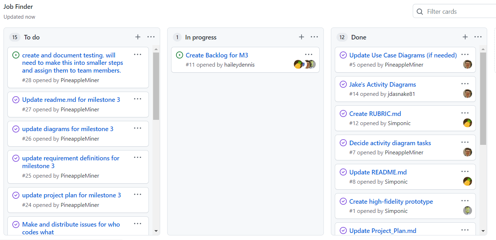

# Report for Feb 17

Team Name: Team one

Scrum Master: Logan Hunt

| Team Member | What did you do since last scrum | What do you plan to do before the next scrum | What obstacles do you have |
| :--- | :--- | :--- | :--- |
| Jake Cogswell | We finished up milestone 2 making sure everyone was finished on time. | | | 
| Hailey Dennis | We finished up milestone 2 making sure everyone was finished on time. | | |
| James Field | We finished up milestone 2 making sure everyone was finished on time. | Create the documents for our scrum reports | None |
| Logan Hunt | We finished up milestone 2 making sure everyone was finished on time. | Prepare to show the team how I set up the api | |

## Burndown

## project board

