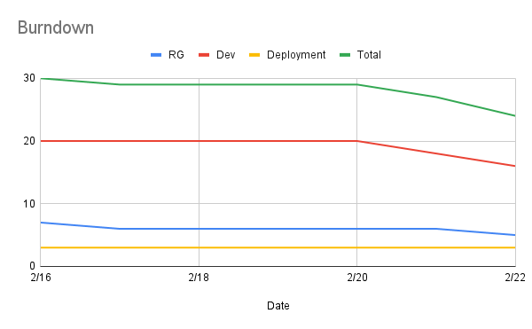
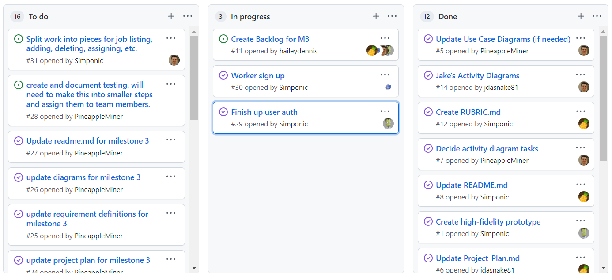

# Report for Feb 22

Team Name: Team one

Scrum Master: Logan Hunt

| Team Member   | What did you do since last scrum | What do you plan to do before the next scrum                               | What obstacles do you have  |
| :---          | :---                             | :---                                                                       | :---                        |
| Jake Cogswell | Getting familiar with codebase   | Research job feature                                                       | Learning Django, React      |
| Hailey Dennis | Getting familiar with codebase   | Figure out how workers should sign up, prototype for availability selector | Learning Django, React      |
| James Field   | Setting up reports for standup   | Make sprint planning docs and burndown chart                               | Learning Django, React      |
| Logan Hunt    | Implemented user authentication  | Making user authentication better by using react context                   | Learning better React hooks |

## Burndown

## project board

