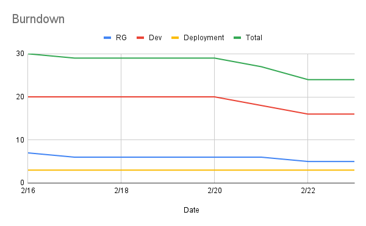

# Report for Feb 24

Team Name: Team one

Scrum Master: Logan Hunt

| Team Member   | What did you do since last scrum        | What do you plan to do before the next scrum   | What obstacles do you have        |
| :---          | :---                                    | :---                                           | :---                              |
| Jake Cogswell | Debug issues getting project running    | Get local dev environment running              | Issues with local dev environment |
| Hailey Dennis | Worked on worker signup                 | Clean up worker signup                         | Making code reusable              |
| James Field   | Work on burndowns, sprint planning docs | Finish up reports                              | Issues with local dev environment |
| Logan Hunt    | Worked on worker signup with Hailey     | Clean up worker signup, introduce fullcalendar | Working on Docker                 |

## Burndown

## project board

