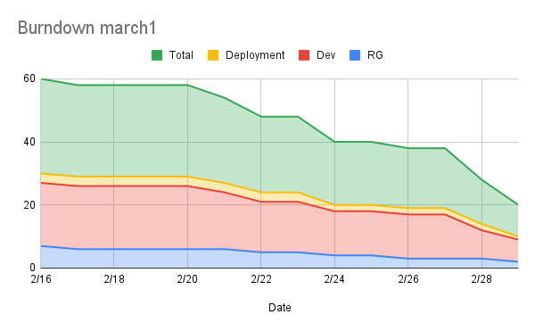
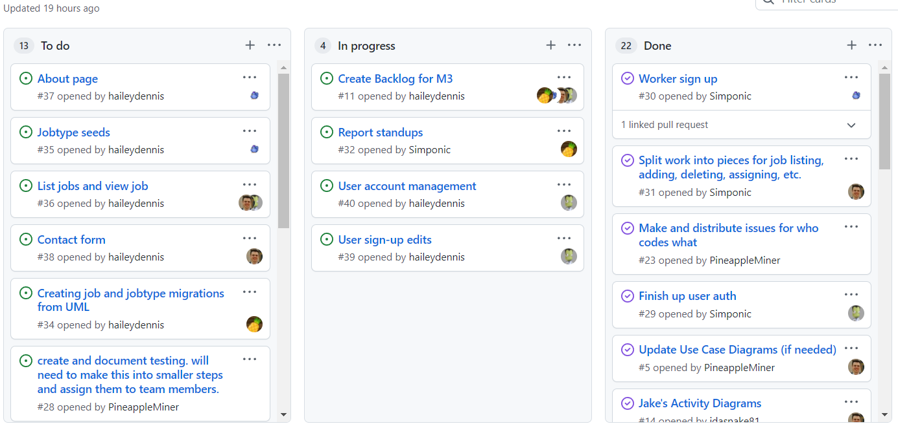

# Report for March 1

Team Name: Team one

Scrum Master: Logan Hunt

| Team Member | What did you do since last scrum | What do you plan to do before the next scrum | What obstacles do you have |
| :--- | :--- | :--- | :--- |
| Jake Cogswell | Got local dev environment running | Start creating contact form component| |
| Hailey Dennis | Cleaned up worker sign up | Create initial jobtypes with icons and names | |
| James Field | Made all documentation in order | Create documentation for next sprint and Create migrations for job and jobtype schema | Need to go through database to make sure I understand everything |
| Logan Hunt | Cleaned up worker signup and introduce the fullcalendar | Add User options | Very time consuming |

## Burndown

## project board

