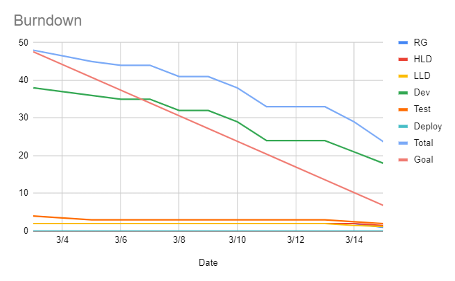
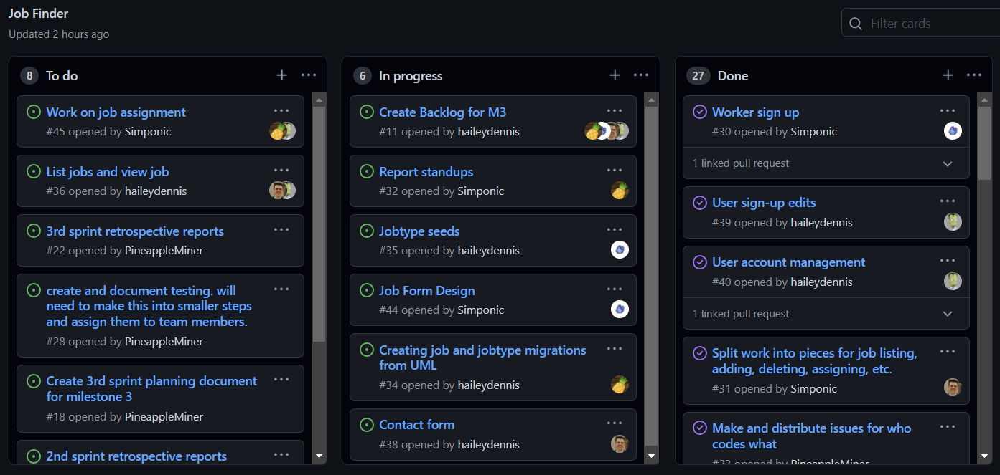

# Report for March 15

Team Name: Team one

Scrum Master: Hailey Dennis

| Team Member   | What did you do since last scrum                                 | What do you plan to do before the next scrum            | What obstacles do you have                          |
| :---          | :---                                                             | :---                                                    | :---                                                |
| Jake Cogswell | Worked on contact form                                           | Finish contact form, work on loading jobs               | Site debugging/errors                               |
| Hailey Dennis | Job listing component, jobtype seeding, navbar stuff, about page | Finish job listing component, job creation component    | Making things look clean, css headaches             |
| James Field   | Job model, jobtype model                                         | Finish jobtype model/job model, work on job assignment  | Webdev environment backend stuff/django hurdles     |
| Logan Hunt    | More user management stuff, user design/css, user popover        | Work on loading jobs, add map for lat/long              | Find a library for map functionality, geocoding API |

## Burndown

## project board

