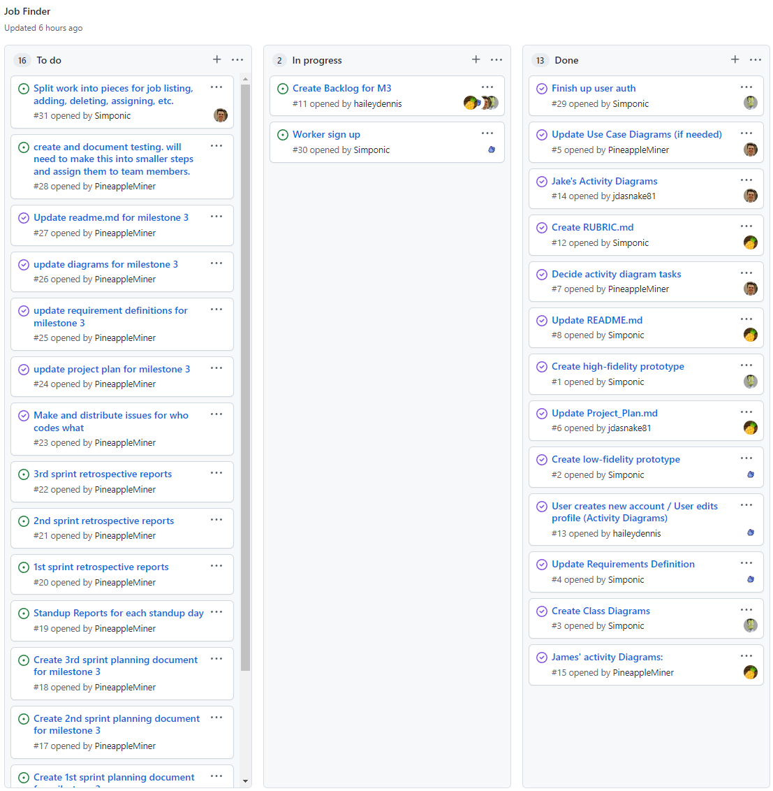

# Report for March 25

Team Name: Team one

Scrum Master: James Field

| Team Member | What did you do since last scrum | What do you plan to do before the next scrum | What obstacles do you have |
| :--- | :--- | :--- | :--- |
| Jake Cogswell | Had a busy week so only did lite work on this project | Testing for the contact form | learning Django testing| 
| Hailey Dennis | Front end design/making it all look better and worked on the map component for the listing page | admin portal | Working more with the backend |
| James Field | Started working/learning how to write unit tests for our models | Write more test cases | not familiar with unit tests in django so a lot of reading |
| Logan Hunt | Finished job listings/assignments | finishing job assignment/making sure edge cases work | Checking correctness of data |

## Burndown

## project board

