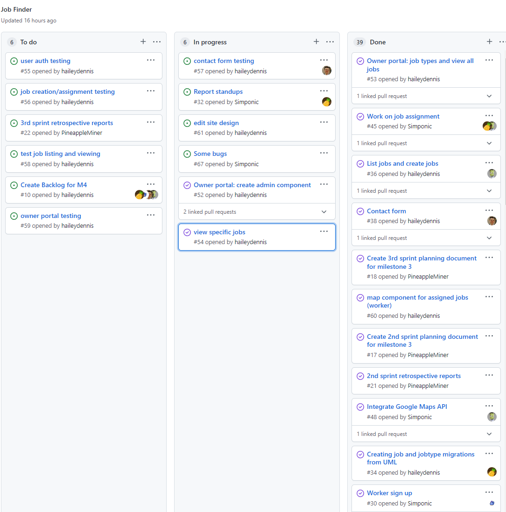

# Report for March 29

Team Name: Team one

Scrum Master: Logan Hunt

| Team Member | What did you do since last scrum | What do you plan to do before the next scrum | What obstacles do you have |
| :--- | :--- | :--- | :--- |
| Jake Cogswell | Setting up testing for contact form | start testing contact form | Django syntax for testing | 
| Hailey Dennis | Worked on owner portal, overall website design (navbar) | finish owner portal | Time very busy week |
| James Field | Worked on more unit tests | more unit tests and write up documentation for it, break up bugs into separate issues | Django syntax for testing |
| Logan Hunt | So much, helped with job listings, job assignments, found and fixed bugs | fix bugs that we found | Regression testing when fixing bugs |

## Burndown

## project board

